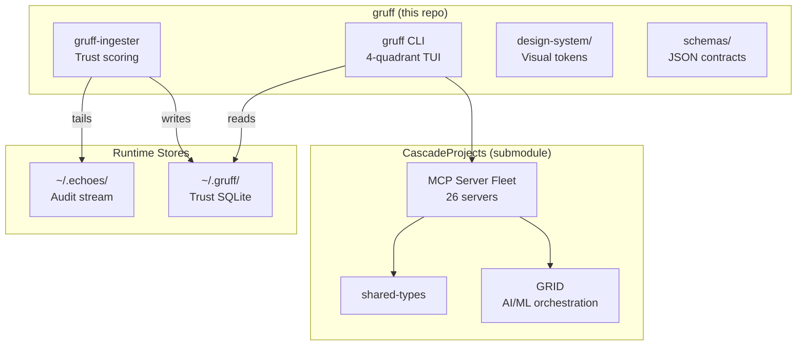

# 🏰 Gruff — Cockpit & Trust-Routing

[](https://www.npmjs.com/package/@irfankabir002/gruff)
[](LICENSE)
[](https://nodejs.org/)
[](https://github.com/caraxesthebloodwyrm02/gruff/actions)

> Workspace cockpit + trust-routing overlay — GRID design system tokens, voice guide, 4-quadrant TUI, and actor-scoring layer over the MCP fleet.

---

## Quick Start

Requires **Node ≥ 22**. `better-sqlite3` builds a native binding on install.

```bash
# One-shot
npx @irfankabir002/gruff@next

# Global install: puts `gruff` + `gruff-ingester` on PATH
npm install -g @irfankabir002/gruff@next
```

```bash
gruff                  # Launch 4-quadrant dashboard
gruff actors           # Trust-scoring leaderboard
gruff init-automation  # Register systemd user timer
```

### From Source

```bash
git clone --recurse-submodules https://github.com/caraxesthebloodwyrm02/gruff.git
cd gruff
npm install && npm run build
```

---

## Architecture



---

## Directory Layout

| Path | Purpose |
|------|---------|
| `src/` | TypeScript source — CLI + ingester |
| `dist/` | Built output (generated) |
| `schemas/` | JSON Schemas — exported by npm |
| `templates/` | Voice guide templates |
| `design-system/` | GRID visual tokens & palette (read-only) |
| `scripts/` | Diagnostics & verification |
| `planes/` | Symlink map — architectural plane view |
| `bridges/` | Inter-system bridges (e.g., gruff ↔ echoes) |
| `docs/` | Governance, architecture, onboarding |
| `CascadeProjects/` | Git submodule → [hogsmade](https://github.com/caraxesthebloodwyrm02/hogsmade) monorepo |

---

## Ecosystem Gates

| Gate | Status | Scope |
|------|--------|-------|
| Central Plaza | ✅ PASS | Universal entry point |
| Trust Routing | ✅ PASS | Actor partition (School / Practice / Hold) |
| Foundation | ✅ PASS | shared-types build sequence |
| Execution | ✅ PASS | 6-stage gated protocol |

---

## Diagnostics

```bash
node scripts/diagnostic-paths.mjs              # Stage 1: path checks
node scripts/diagnostic-paths.mjs --bugs       # Stage 1+2: + bug scan
node scripts/diagnostic-paths.mjs --bugs --format  # All stages
make verify-planes                             # Planes drift check
make fourfold-snap                             # Foundation snap
```

---

## Documentation

| Doc | Description |
|-----|-------------|
| [`docs/SPEC.md`](docs/SPEC.md) | Architecture, vision, governance |
| [`docs/CENTRAL_PLAZA.md`](docs/CENTRAL_PLAZA.md) | District map & health dashboard |
| [`docs/GATE.md`](docs/GATE.md) | Trust-routing gate & attribute matrix |
| [`docs/WORKSPACE_GATES.md`](docs/WORKSPACE_GATES.md) | 6-stage gated execution protocol |
| [`docs/REFERENCE.md`](docs/REFERENCE.md) | Canonical document index |
| [`docs/ONBOARDING.md`](docs/ONBOARDING.md) | Onboarding tracks & modes |
| [`CLAUDE.md`](CLAUDE.md) | Agent charters & operational rules |
| [`AGENTS.md`](AGENTS.md) | Agent registry |
| [`CONTRIBUTING.md`](CONTRIBUTING.md) | Contributor guide & PR expectations |
| [`SECURITY.md`](SECURITY.md) | Vulnerability disclosure policy |

---

## Docker

Run the trust ingester as a container:

```bash
docker compose up -d
```

See [`Dockerfile`](Dockerfile) and [`docker-compose.yml`](docker-compose.yml).

---

## License

[Apache-2.0](LICENSE) — Copyright 2026 Irfan Kabir

The `CascadeProjects/` submodule is licensed separately under its own terms.

**Version:** 0.1.2
