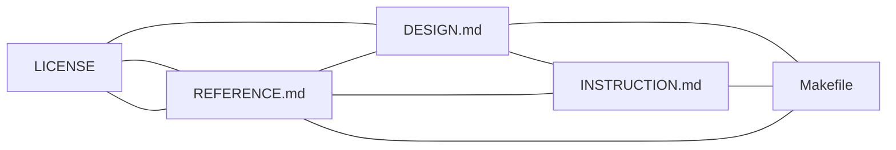

# Fourfold cascade and nearest neighborhood

This document ties **`LICENSE`**, **`DESIGN.md`**, **`Makefile`**, **`REFERENCE.md`**, and **`INSTRUCTION.md`** into one **fourfold** map plus a **nearest-neighbor** graph so you always know the next hop.

**Sixteenfold:** the same four **archetypes** repeat across four **strata** (umbrella, hogsmade, GRID, operator overlay). See [`SIXTEENFOLD_NEIGHBORHOOD.md`](SIXTEENFOLD_NEIGHBORHOOD.md).

## The four folds

| Fold | File | Role |
|------|------|------|
| **1 — Covenant** | [`LICENSE`](../LICENSE) | **Apache-2.0** for this umbrella repository. Submodule code follows [`CascadeProjects/LICENSE`](../CascadeProjects/LICENSE) (its own terms). |
| **2 — Cartography** | [`DESIGN.md`](../DESIGN.md) | Boundaries: umbrella vs submodule, where GRID and Pi sit. |
| **3 — Circuit** | [`Makefile`](../Makefile) | Executable edges: `verify-planes`, submodule init. |
| **4 — Cadence** | [`INSTRUCTION.md`](../INSTRUCTION.md) | Ordered procedures: clone, loops, submodule bumps, nested rules. |

**Hub:** [`REFERENCE.md`](../REFERENCE.md) indexes SPEC, CLAUDE, AGENTS, CONTRIBUTING, and nested `AGENTS.md` paths — it is the **bibliographic center**, not a fifth fold.

## Nearest neighborhood (adjacency)

Each node lists its **nearest** docs (same directory or one logical hop):

| Node | Neighbors |
|------|-----------|
| **LICENSE** | REFERENCE (index), DESIGN (what is licensed), CONTRIBUTING (policy), CascadeProjects/LICENSE (submodule) |
| **DESIGN** | LICENSE, INSTRUCTION, Makefile, REFERENCE, AGENTS (voices) |
| **Makefile** | INSTRUCTION, REFERENCE, scripts/verify-planes.sh |
| **INSTRUCTION** | Makefile, LICENSE, CONTRIBUTING, ONBOARDING |
| **REFERENCE** | All fourfold files + SPEC + CLAUDE + nested AGENTS paths |

## Experience voices (from `AGENTS.md` files)

Characters here are **routing hints** for *which doc to trust first*, not lore.

| Voice | Where defined | When it applies |
|-------|----------------|-------------------|
| **prince-runtime-intel** | Root / `CascadeProjects` [`AGENTS.md`](../AGENTS.md) | Default coding and ecosystem work. |
| **hermes** | Same | Submodule coordination, cross-project mediation. |
| **caraxes** | Same | Marketplace and plugin scouting. |
| **GRID windows** | [`GRID-main/AGENTS.md`](../CascadeProjects/Projects/GRID-main/AGENTS.md) | Narrow debugging to one of four surfaces (Python, frontend, Electron, landing). |
| **Pi isolation** | [`.pi/AGENTS.md`](../CascadeProjects/.pi/AGENTS.md) | Tool lists, skills, and **network isolation** before external calls. |

## Four on the floor (composition snap)

When the root four files are **locked** together as one slab, the composition is **floor-complete** (~92%+ — see [`FOUR_ON_THE_FLOOR.md`](FOUR_ON_THE_FLOOR.md)). Run `make fourfold-snap` from the repo root to verify presence + [`artifacts/session-seal.json`](artifacts/session-seal.json).

## Related onboarding

- [`ONBOARDING.md`](ONBOARDING.md) — tracks (school vs market), modes, ambiance walks.
- [`the-elevator-ride.md`](the-elevator-ride.md) — laps and curvature vs agent streams.
