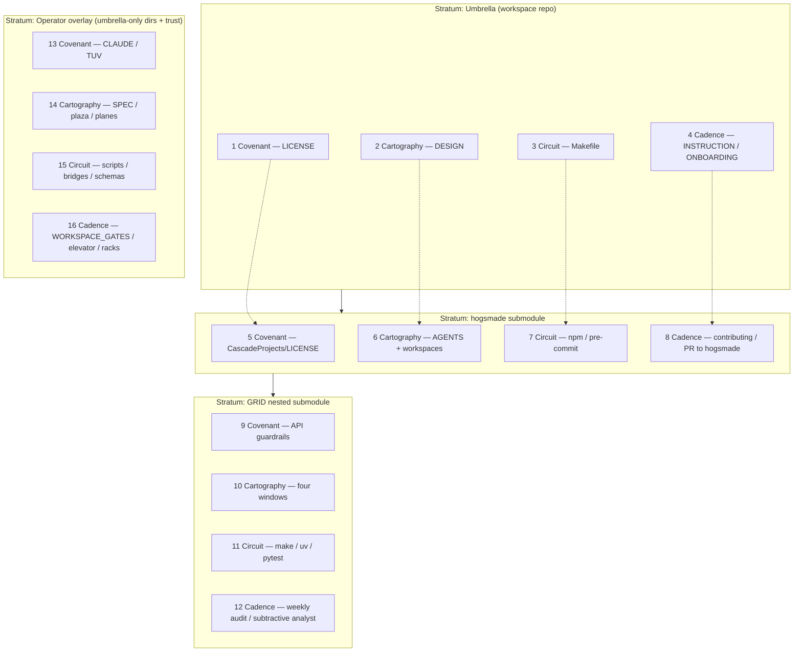

# Sixteenfold cascade and neighborhood

The **fourfold** (`[FOURFOLD_NEIGHBORHOOD.md](FOURFOLD_NEIGHBORHOOD.md)`) is **row 1** below: the umbrella’s **Covenant → Cartography → Circuit → Cadence** files. The **sixteenfold** repeats that same **four archetypes** across **four strata** so git-configured repos, nested submodules, and operator-only trees each get a full lap.

## Axes

| Axis                   | Meaning                                                                                                                                    |
| ---------------------- | ------------------------------------------------------------------------------------------------------------------------------------------ |
| **Stratum (row)**      | Where the `.git` boundary sits: umbrella root → hogsmade monorepo → GRID nested repo → operator overlay (planes, gates, Pi-adjacent docs). |
| **Archetype (column)** | **Covenant** (terms, guardrails), **Cartography** (maps, boundaries), **Circuit** (build, verify), **Cadence** (procedure, rhythm).        |

## The 16 folds (numbered 1–16)

| #      | Stratum                       | Archetype   | Primary anchor                                                                                                                  | Voice / lens                                              |
| ------ | ----------------------------- | ----------- | ------------------------------------------------------------------------------------------------------------------------------- | --------------------------------------------------------- |
| **1**  | Umbrella                      | Covenant    | `[LICENSE](../LICENSE)` (**Apache-2.0**)                                                                                        | **prince** — default ownership of shipped tree            |
| **2**  | Umbrella                      | Cartography | `[DESIGN.md](../DESIGN.md)`                                                                                                     | **hermes** — umbrella vs submodule borders                |
| **3**  | Umbrella                      | Circuit     | `[Makefile](../Makefile)`                                                                                                       | **prince** — `verify-planes`, `submodule-init`            |
| **4**  | Umbrella                      | Cadence     | `[INSTRUCTION.md](../INSTRUCTION.md)`, `[ONBOARDING.md](ONBOARDING.md)`                                                         | **hermes** — clone/bump loops                             |
| **5**  | hogsmade (`CascadeProjects/`) | Covenant    | `[CascadeProjects/LICENSE](../CascadeProjects/LICENSE)` (**MIT** as published)                                                  | **hermes** — pointer + monorepo terms                     |
| **6**  | hogsmade                      | Cartography | `[CascadeProjects/AGENTS.md](../CascadeProjects/AGENTS.md)`, `Tools/` · `Components/` · `Applications/`                         | **prince** — day-to-day implementation surface            |
| **7**  | hogsmade                      | Circuit     | Root `package.json` scripts (`npm run *`), `pre-commit`                                                                         | **prince** — format/lint/build/test                       |
| **8**  | hogsmade                      | Cadence     | `[CONTRIBUTING.md](../CONTRIBUTING.md)` (submodule section), PR flow to hogsmade                                                | **hermes** — cross-repo mediation                         |
| **9**  | GRID (`Projects/GRID-main/`)  | Covenant    | `[AGENTS.md](../CascadeProjects/Projects/GRID-main/AGENTS.md)` §Security guardrails (and linked attack-surface docs from there) | Security / policy voice                                   |
| **10** | GRID                          | Cartography | `[AGENTS.md](../CascadeProjects/Projects/GRID-main/AGENTS.md)` §Debugging scope windows                                         | **Four windows** — Python / frontend / Electron / landing |
| **11** | GRID                          | Circuit     | `make` targets, `uv run pytest`, coverage slices in `[AGENTS.md](../CascadeProjects/Projects/GRID-main/AGENTS.md)`              | Narrowest failing gate first                              |
| **12** | GRID                          | Cadence     | `[AGENTS.md](../CascadeProjects/Projects/GRID-main/AGENTS.md)` §Weekly git / coverage audit                                     | **Subtractive analyst** (git hygiene prompts)             |
| **13** | Operator overlay              | Covenant    | `[CLAUDE.md](../CLAUDE.md)`, TUV / trust rules in `~/.claude/rules/dev-rules.md` (referenced from `[AGENTS.md](../AGENTS.md)`)  | Trust contract                                            |
| **14** | Operator overlay              | Cartography | `[SPEC.md](../SPEC.md)`, `[CENTRAL_PLAZA.md](../CENTRAL_PLAZA.md)`, `planes/`                                                   | Plaza / architecture vocabulary                           |
| **15** | Operator overlay              | Circuit     | `scripts/verify-*.sh`, `bridges/`, `schemas/`                                                                                   | **prince** — local glue and contracts                     |
| **16** | Operator overlay              | Cadence     | `[WORKSPACE_GATES.md](../WORKSPACE_GATES.md)`, `[the-elevator-ride.md](the-elevator-ride.md)`, `racks/`                         | Reconcile lap — gates + cognition overlay                 |

**Hub (still not a fold):** `[REFERENCE.md](../REFERENCE.md)` — one-hop index across strata.

## Partition diagram (git modules × archetypes)

Umbrella `.gitmodules` registers `**CascadeProjects`** → hogsmade. Inside hogsmade, `.gitmodules` registers `**Projects/GRID-main**` → GRID. Other paths (`planes/`, `racks/`, `docs/`, …) are **not** separate remotes; they belong to the umbrella commit unless ignored.

Solid arrows **U → H → G** follow **git submodule** inclusion. Dotted lines **1→5, 2→6, …** show the **same archetype column** down-stratum (nearest semantic neighbor).

## Nearest neighborhood at sixteenfold resolution

- **Within a stratum:** move left/right by archetype (covenant ↔ cadence); folds **1–4** are the documented fourfold cluster.
- **Across strata:** move to the same archetype on the next stratum (e.g. **2 → 6 → 10 → 14**) for “same kind of question, deeper repo.”
- **Across repos:** changing **5–8** commits **hogsmade**; changing **9–12** commits **GRID**; **13–16** usually commit to **umbrella** unless you are only updating submodule pointers (**4**, **8**).

## Relation to fourfold

The **first four folds** are exactly the root **LICENSE**, **DESIGN.md**, **Makefile**, **INSTRUCTION.md** (+ onboarding for cadence context). Everything else **refines** the same four moves under nested `.git` boundaries and operator-only trees — see `[FOURFOLD_NEIGHBORHOOD.md](FOURFOLD_NEIGHBORHOOD.md)`.

## Relation to eightfold (compaction)

For **half-state** daily use (**16 → 8** octants), **DRY/WET gain staging**, and **swing vs gesture**, see `[COMPOSITION_EIGHTFOLD_GAIN.md](COMPOSITION_EIGHTFOLD_GAIN.md)`.
